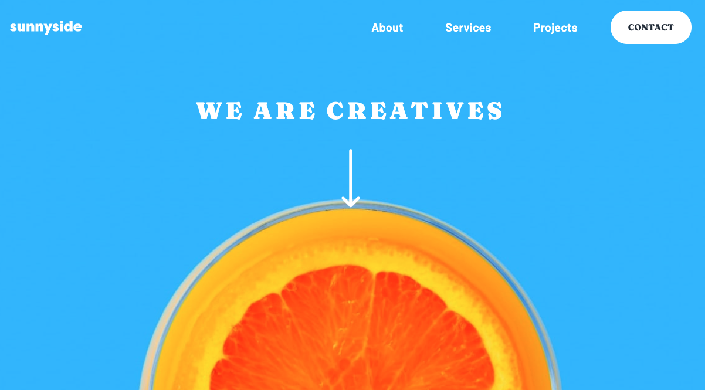

# Frontend Mentor - Sunnyside agency landing page solution

This is a solution to the [Sunnyside agency landing page challenge on Frontend Mentor](https://www.frontendmentor.io/challenges/sunnyside-agency-landing-page-7yVs3B6ef). Frontend Mentor challenges help you improve your coding skills by building realistic projects.

## Table of contents

- [Overview](#overview)
  - [The challenge](#the-challenge)
  - [Screenshot](#screenshot)
  - [Links](#links)
- [My process](#my-process)
  - [Built with](#built-with)
  - [What I learned](#what-i-learned)
  - [Useful resources](#useful-resources)
- [Author](#author)
## Overview

### The challenge

Users should be able to:

- View the optimal layout for the site depending on their device's screen size
- See hover states for all interactive elements on the page

### Screenshot

### Links

- Solution URL: [Solution](https://github.com/cah90/sunnyside-agency)
- Live Site URL: [Sunnyside Page](https://cah90.github.io/sunnyside-agency/)

## My process

### Built with

- Semantic HTML5 markup
- CSS custom properties
- Flexbox
- CSS Grid
- Mobile-first workflow

### What I learned

### Useful resources

- [CSS-TRICKS](https://css-tricks.com/snippets/css/a-guide-to-flexbox/) - This is my bible when it comes to a guide on flex.
- [CSS-TRICKS](https://css-tricks.com/snippets/css/complete-guide-grid/) - I always go to these two links because they are by dar the best source when I have questions about grid or flex.

## Author

- Website - [Cah](https://www.cassiabernardo.com)
- Frontend Mentor - [@cah90](https://www.frontendmentor.io/profile/cah90)

